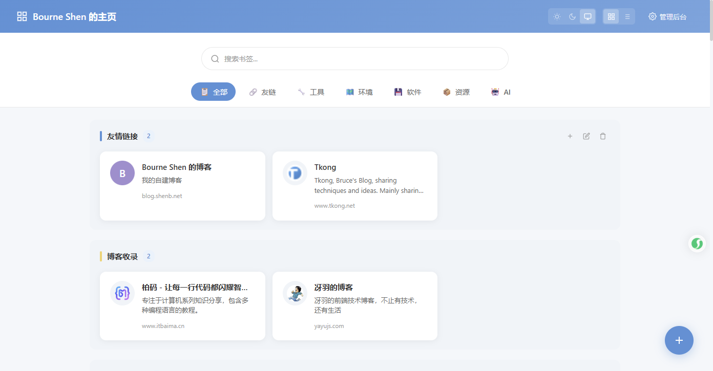

# Nav Site

[
](https://github.com/shenbourne/Nav-Site)
[](https://hub.docker.com/repository/docker/shenbourne/nav-site)

一个简洁美观的个人导航网站，支持分类管理、链接收藏、暗色模式等功能。基于 Vue 3 + Express 5 构建，支持 Docker 一键部署。



demo 网页：https://nav.shenb.net/

## ✨ 功能特性

- **分类管理** - 支持两级分类体系（一级分类 + 二级分类），支持 Emoji 图标选择器
- **链接管理** - 添加/编辑/删除/移动链接，支持自动获取网站标题、描述和图标
- **自定义按钮** - 每个链接可添加多个自定义快捷按钮
- **ToolTip 支持** - 鼠标悬停卡片时，鼠标位置旁浮现 tooltip 显示完整的标题和描述
- **搜索功能** - 全局搜索书签，支持按标题、描述、URL 匹配
- **本地图标库** - 支持从本地图标库匹配图标
- **布局切换** - 支持分页模式和一栏模式两种布局
- **暗色模式** - 支持亮色/暗色/跟随系统三种主题
- **拖拽排序** - 支持分类和链接的拖拽排序
- **站点设置** - 自定义站点标题和 Logo，浏览器标签栏图标同步
- **管理后台** - JWT 认证，支持密码修改
- **Logo 上传** - 支持图片 URL 和本地文件上传两种方式
- **Docker 部署** - 多阶段构建，数据持久化

## 🚀 快速开始

### 🧰 本地开发

**安装依赖**

```bash
# 后端
cd backend
npm install

# 前端
cd ../frontend
npm install
```

**启动服务**

```bash
# 启动后端 (端口 3000)
cd backend
node server.js

# 启动前端 (端口 5173)
cd frontend
npm run dev
```

访问 `http://localhost:5173` 即可使用。

**首次启动时会自动创建管理员账号**

- 用户名：`admin`
- 密码：`admin123`

> 建议首次登录后立即修改密码。

### 📦 Docker 部署

```bash
# 使用 Docker Compose 一键部署
docker compose up -d
```

``` yaml
# docker-compose.yml

services:
  nav-site:
    image: "shenbourne/nav-site:latest"
    ports:
      - "3000:3000"
    volumes:
      - ./backend/data:/app/data
    restart: unless-stopped
```

访问 `http://localhost:3000` 即可使用。

数据通过 volume 持久化到 `./backend/data` 目录，包括导航数据、认证配置和上传的文件。

**首次启动时会自动创建管理员账号**

- 用户名：`admin`
- 密码：`admin123`

> 建议首次登录后立即修改密码。

## ⚙️ 技术栈

| 模块 | 技术 |
|------|------|
| 前端框架 | Vue 3 (Composition API) |
| 状态管理 | Pinia |
| 构建工具 | Vite 7 |
| HTTP 客户端 | Axios |
| 拖拽排序 | vuedraggable |
| 后端框架 | Express 5 |
| 认证 | JWT + bcryptjs |
| 文件上传 | Multer |
| 网页解析 | Cheerio |
| 数据存储 | JSON 文件 |
| 容器化 | Docker (多阶段构建) |


## ⛓️ API 概览

| 方法 | 路径 | 说明 | 认证 |
|------|------|------|------|
| GET | `/api/categories` | 获取所有分类及链接 | 否 |
| POST | `/api/categories` | 创建一级分类 | 是 |
| PUT | `/api/categories/:id` | 更新一级分类 | 是 |
| DELETE | `/api/categories/:id` | 删除一级分类 | 是 |
| POST | `/api/categories/:catId/subcategories` | 创建二级分类 | 是 |
| POST | `/api/categories/:catId/subcategories/:subId/links` | 创建链接 | 是 |
| PUT | `/api/categories/:catId/subcategories/:subId/links/:linkId` | 更新链接 | 是 |
| POST | `/api/links/move` | 跨分类移动链接 | 是 |
| GET | `/api/settings` | 获取站点设置 | 否 |
| PUT | `/api/settings` | 更新站点设置 | 是 |
| POST | `/api/upload-logo` | 上传 Logo | 是 |
| POST | `/api/fetch-meta` | 抓取网页元数据 | 是 |
| POST | `/api/login` | 登录 | 否 |
| PUT | `/api/change-password` | 修改密码 | 是 |

## 📜 许可证

本项目采用 GNU AGPLv3 协议开源。
